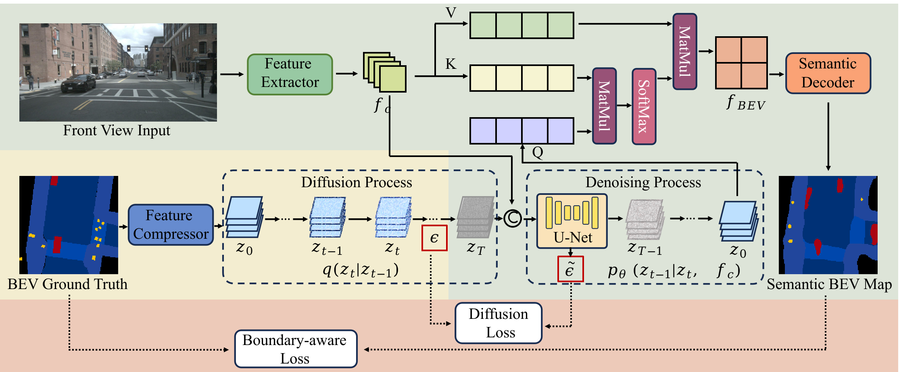
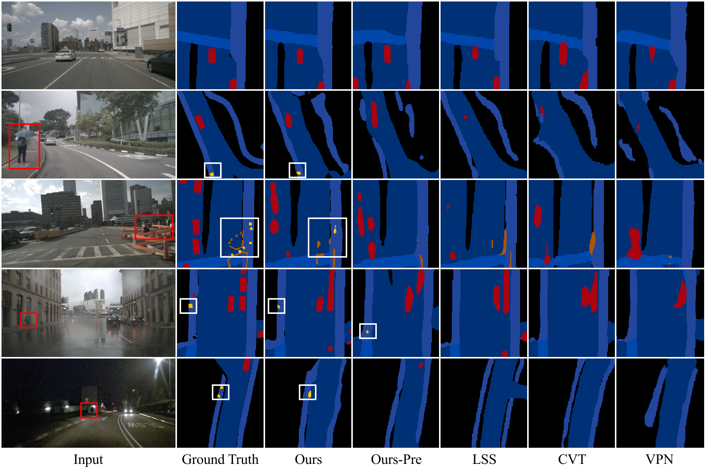

# Boundary-aware-BEV
This is the offical PyTorch implementation of Boundary-aware Semantic Bird-Eye-View Map Generation based on Conditional Diffusion Models

# Introduction
Semantic bird-eye-view (BEV) map is an efficient data representation for environment perception in autonomous driving. In real driving scenarios, the collected sensory data usually exhibit class imbalance. For example, road layouts are often the majority classes and road objects are the minority. Such imbalanced data could lead to inferior performance in BEV map generation, particularly for minority objects due to insufficient learning samples. This work attempts to mitigate this issue from the perspective of network and loss function design. To this end, a diffusion-guided semantic BEV map generation network with a boundary-aware loss is proposed. The network learns the underlying distribution of the data, including the relationship between majority and minority classes. The boundary-aware loss increases weighting for minority classes during training, making the network focus on these classes. Experimental results on a public dataset demonstrate our superiority over the state-of-the-art methods, and our effectiveness in addressing the class imbalance issue.

# Contributions
- We design a novel diffusion-guided semantic BEV map generation network, which uses the diffusion model to learn the distribution characteristics of the minority classes and initialize the BEV queries with the prior information of the entire driving scenes. 
- We design the boundary-aware loss is designed to assign different weights for the majority and minority classes, mitigating the impact of the class imbalance problem. 
- The superiority of our proposed network is demonstrated by comparing it with state-of-the-art methods via extensive experiments.

# Train on Boundary-aware-BEV
python ./scripts/train_latent_diff.py --if_BoundaryLoss

# Results
